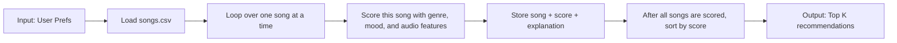

# 🎵 Music Recommender Simulation

## Project Summary

In this project you will build and explain a small music recommender system.

Your goal is to:

- Represent songs and a user "taste profile" as data
- Design a scoring rule that turns that data into recommendations
- Evaluate what your system gets right and wrong
- Reflect on how this mirrors real world AI recommenders

Replace this paragraph with your own summary of what your version does.

---

## How The System Works

Explain your design in plain language.

Some prompts to answer:

- What features does each `Song` use in your system
  - For example: genre, mood, energy, tempo
- What information does your `UserProfile` store
- How does your `Recommender` compute a score for each song
- How do you choose which songs to recommend

You can include a simple diagram or bullet list if helpful.

Answer:
My recommender uses a transparent, rule-based scoring recipe. For each song in the catalog, it computes a match score against a user taste profile and then ranks songs from highest score to lowest score.

Algorithm recipe:

1. Read user preferences
  - Weighted categorical preferences: `preferred_genres`, `favorite_moods`
  - Numeric targets + tolerances: `target_energy`, `target_tempo_bpm`, `target_valence`, `target_danceability`, `target_acousticness`
  - Optional controls: `weighting_scheme`, `excluded_genres`, `novelty_preference`, `diversity_boost`

2. Score each song with additive rules
  - Choose one weighting scheme where all feature weights sum to `1.00`:
    - `conservative`: genre-led
    - `balanced` (default): genre and mood close, with strong audio feature support
    - `exploratory`: mood + audio features stronger than genre
  - Add categorical contributions for matched genre/mood.
  - Add numeric similarity contributions using:
    closeness = `max(0, 1 - abs(value - target) / tolerance)`
    then contribution = `feature_weight * closeness`.
  - Apply guardrails with optional penalties/bonuses (`excluded_genres`, `novelty_preference`, `diversity_boost`).

3. Create explanation strings
  - Store per-feature contribution notes (for example: `genre match +2.00`, `energy proximity +0.83`).
  - Join these notes into a human-readable reason for each recommendation.

4. Rank and return top-k
  - Sort songs by score descending.
  - Return the top `k` songs with `(song, score, explanation)`.

Song features used: `genre`, `mood`, `energy`, `tempo_bpm`, `valence`, `danceability`, and `acousticness`.

Example taste profile dictionary:

```python
user_prefs = {
  "weighting_scheme": "balanced",
  "preferred_genres": {"house": 1.0, "synthwave": 0.6, "pop": 0.3},
  "favorite_moods": {"euphoric": 1.0, "happy": 0.5},
  "target_energy": 0.86,
  "energy_tolerance": 0.18,
  "target_tempo_bpm": 124,
  "tempo_tolerance_bpm": 18,
  "target_valence": 0.78,
  "valence_tolerance": 0.20,
  "target_danceability": 0.88,
  "danceability_tolerance": 0.15,
  "target_acousticness": 0.12,
  "acousticness_tolerance": 0.18,
  "excluded_genres": ["lofi"],
  "novelty_preference": 0.25,
  "diversity_boost": 0.20,
}
```

### Design Map




---

## Getting Started

### Setup

1. Create a virtual environment (optional but recommended):

   ```bash
   python -m venv .venv
   source .venv/bin/activate      # Mac or Linux
   .venv\Scripts\activate         # Windows

2. Install dependencies

```bash
pip install -r requirements.txt
```

3. Run the app:

```bash
python -m src.main
```

### Running Tests

Run the starter tests with:

```bash
pytest
```

You can add more tests in `tests/test_recommender.py`.

### Dataset Files (for Better Evaluation)

- `data/songs.csv`: Full balanced catalog (100 songs)
- `data/songs_train.csv`: Train-like split (80 songs)
- `data/songs_eval.csv`: Eval-like split (20 songs)
- `data/songs_adversarial.csv`: Hard cases that stress conflicting features

Recommended workflow:

1. Tune weights on `songs_train.csv`
2. Check stability on `songs_eval.csv`
3. Probe failure modes on `songs_adversarial.csv`

---

## Experiments You Tried

Use this section to document the experiments you ran. For example:

- What happened when you changed the weight on genre from 2.0 to 0.5
- What happened when you added tempo or valence to the score
- How did your system behave for different types of users

---

## Limitations and Risks

Summarize some limitations of your recommender.

Examples:

- It only works on a tiny catalog
- It does not understand lyrics or language
- It might over favor one genre or mood

You will go deeper on this in your model card.

---

## Reflection

Read and complete `model_card.md`:

[**Model Card**](model_card.md)

Write 1 to 2 paragraphs here about what you learned:

- about how recommenders turn data into predictions
- about where bias or unfairness could show up in systems like this


---

## 7. `model_card_template.md`

Combines reflection and model card framing from the Module 3 guidance. :contentReference[oaicite:2]{index=2}  

```markdown
# 🎧 Model Card - Music Recommender Simulation

## 1. Model Name

Give your recommender a name, for example:

> VibeFinder 1.0

---

## 2. Intended Use

- What is this system trying to do
- Who is it for

Example:

> This model suggests 3 to 5 songs from a small catalog based on a user's preferred genre, mood, and energy level. It is for classroom exploration only, not for real users.

---

## 3. How It Works (Short Explanation)

Describe your scoring logic in plain language.

- What features of each song does it consider
- What information about the user does it use
- How does it turn those into a number

Try to avoid code in this section, treat it like an explanation to a non programmer.

---

## 4. Data

Describe your dataset.

- How many songs are in `data/songs.csv`
- Did you add or remove any songs
- What kinds of genres or moods are represented
- Whose taste does this data mostly reflect

---

## 5. Strengths

Where does your recommender work well

You can think about:
- Situations where the top results "felt right"
- Particular user profiles it served well
- Simplicity or transparency benefits

---

## 6. Limitations and Bias

Where does your recommender struggle

Some prompts:
- Does it ignore some genres or moods
- Does it treat all users as if they have the same taste shape
- Is it biased toward high energy or one genre by default
- How could this be unfair if used in a real product

---

## 7. Evaluation

How did you check your system

Examples:
- You tried multiple user profiles and wrote down whether the results matched your expectations
- You compared your simulation to what a real app like Spotify or YouTube tends to recommend
- You wrote tests for your scoring logic

You do not need a numeric metric, but if you used one, explain what it measures.

---

## 8. Future Work

If you had more time, how would you improve this recommender

Examples:

- Add support for multiple users and "group vibe" recommendations
- Balance diversity of songs instead of always picking the closest match
- Use more features, like tempo ranges or lyric themes

---

## 9. Personal Reflection

A few sentences about what you learned:

- What surprised you about how your system behaved
- How did building this change how you think about real music recommenders
- Where do you think human judgment still matters, even if the model seems "smart"

