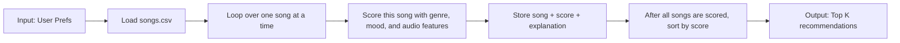

# 🎵 Music Recommender Simulation

## Project Summary

In this project you will build and explain a small music recommender system.

Your goal is to:

- Represent songs and a user "taste profile" as data
- Design a scoring rule that turns that data into recommendations
- Evaluate what your system gets right and wrong
- Reflect on how this mirrors real world AI recommenders

This version builds a transparent, rule-based recommender that scores each song with genre, mood, and audio-feature similarity, then returns top-k songs with explanation reasons. I also tested adversarial profiles and small logic changes to study sensitivity, bias, and failure modes.

---

## How The System Works

My recommender uses a transparent, rule-based scoring recipe. For each song in the catalog, it computes a match score against a user taste profile and then ranks songs from highest score to lowest score.

Algorithm recipe:

1. Read user preferences
  - Weighted categorical preferences: `preferred_genres`, `favorite_moods`
  - Numeric targets + tolerances: `target_energy`, `target_tempo_bpm`, `target_valence`, `target_danceability`, `target_acousticness`
  - Optional controls: `weighting_scheme`, `excluded_genres`, `novelty_preference`, `diversity_boost`

2. Score each song with additive rules
  - Choose one weighting scheme where all feature weights sum to `1.00`:
    - `conservative`: genre-led
    - `balanced` (default): genre and mood close, with strong audio feature support
    - `exploratory`: mood + audio features stronger than genre
  - Add categorical contributions for matched genre/mood.
  - Add numeric similarity contributions using:
    closeness = `max(0, 1 - abs(value - target) / tolerance)`
    then contribution = `feature_weight * closeness`.
  - Apply guardrails with optional penalties/bonuses (`excluded_genres`, `novelty_preference`, `diversity_boost`).

3. Create explanation strings
  - Store per-feature contribution notes (for example: `genre match +2.00`, `energy proximity +0.83`).
  - Join these notes into a human-readable reason for each recommendation.

4. Rank and return top-k
  - Sort songs by score descending.
  - Return the top `k` songs with `(song, score, explanation)`.

Song features used: `genre`, `mood`, `energy`, `tempo_bpm`, `valence`, `danceability`, and `acousticness`.

Example taste profile dictionary:

```python
user_prefs = {
  "weighting_scheme": "balanced",
  "preferred_genres": {"house": 1.0, "synthwave": 0.6, "pop": 0.3},
  "favorite_moods": {"euphoric": 1.0, "happy": 0.5},
  "target_energy": 0.86,
  "energy_tolerance": 0.18,
  "target_tempo_bpm": 124,
  "tempo_tolerance_bpm": 18,
  "target_valence": 0.78,
  "valence_tolerance": 0.20,
  "target_danceability": 0.88,
  "danceability_tolerance": 0.15,
  "target_acousticness": 0.12,
  "acousticness_tolerance": 0.18,
  "excluded_genres": ["lofi"],
  "novelty_preference": 0.25,
  "diversity_boost": 0.20,
}
```

### Design Map



### Evaluation Plan

To make the recommendation behavior easier to study, I use three related dataset views from the same balanced catalog:

- `data/songs_train.csv`: tune the weighting scheme and check the main ranking behavior
- `data/songs_eval.csv`: verify the recommendations still look reasonable on a held-out split
- `data/songs_adversarial.csv`: stress-test cases where audio features or mood/genre signals conflict

This setup helps answer three questions: does the scoring rule work on the main catalog, does it generalize to unseen songs, and where does it break down when the signals disagree?

### Algorithm Recipe

My final scoring recipe uses a balanced, weighted sum of genre, mood, and audio similarity:

1. Choose a weighting scheme
  - `conservative`: genre-led
  - `balanced` (default): genre and mood stay close, while audio features still matter
  - `exploratory`: mood and audio similarity matter more than genre

2. Score one song at a time
  - Add a genre-match contribution when the song's genre overlaps with the user's preferred genres.
  - Add a mood-match contribution when the song's mood overlaps with the user's favorite moods.
  - For each numeric feature, compute closeness with:
    `closeness = max(0, 1 - abs(value - target) / tolerance)`
    then multiply by the feature weight for that scheme.
  - Optionally subtract a small penalty for excluded genres and add a small novelty/diversity bump when requested.

3. Rank the full catalog
  - Score every song in the CSV.
  - Sort all songs from highest score to lowest score.
  - Return the top `k` songs as the final recommendation list.

Potential bias note: This system can still over-prioritize genre if the genre weights are too high, which could hide songs that match the user's mood or audio preferences very well. It may also reflect whatever genres and moods are most common in the catalog, so rare styles can be under-recommended unless the exploratory or diversity settings are used.


---

## Getting Started

### Setup

1. Create a virtual environment (optional but recommended):

   ```bash
   python -m venv .venv
   source .venv/bin/activate      # Mac or Linux
   .venv\Scripts\activate         # Windows

2. Install dependencies

```bash
pip install -r requirements.txt
```

3. Run the app:

```bash
python -m src.main
```

### Terminal Output Screenshot


### Running Tests

Run tests with:

```bash
pytest
```

You can add more tests in `tests/test_recommender.py`.

---

## Experiments You Tried

### System Evaluation: Intuition Check

I compared model outputs against my own listening intuition with two profiles that reflect real-life mood regulation goals.

Profile A was a calm mode profile (classical + pop preferences, relaxed/chill moods, moderate energy, higher acousticness). Profile B was a courage mode profile (pop-forward preferences, confident/euphoric/happy moods, higher energy and tempo). For each profile, I reviewed the top-5 recommendations and checked whether the songs felt appropriate for the intended emotional state.

The courage mode results felt mostly right. The top recommendations were pop-leaning and emotionally uplifting, which matched my expectation for songs that help me become more motivated and confident. The calm mode results were only partially right. The emotional tone was often calm, but genre alignment drifted toward jazz/country/lofi in top positions, and classical appeared lower than expected.

This experiment suggests the current scoring logic is better at matching mood and numeric audio targets than matching fine-grained style intent (for example, piano-classical preference). A practical improvement is to treat calm mode and courage mode as separate user states rather than one mixed profile, then compare outputs per state.

### Small Data Sensitivity Experiment

I tested one controlled change to check sensitivity:

- **Weight Shift** (temporary experiment):
  - doubled `energy_proximity` in the balanced scheme (`0.16 -> 0.32`)
  - halved `genre_match` in the balanced scheme (`0.24 -> 0.12`)

I then re-ran `main.py` with the default demo profile and compared top-5 results.

Baseline top-5 (`high_energy_pop` / default balanced):
1. Neon Pulse
2. Neon Letters
3. Lunar Boulevard
4. Neon Skyline
5. Silver Horizon

Experimental top-5 (after weight shift):
1. Neon Pulse
2. Neon Letters
3. Neon Skyline
4. Neon Rhythm
5. Lunar Boulevard

What this change showed:

- The system became more energy-driven and less genre-anchored.
- Rankings shifted toward tracks with stronger energy proximity, even without direct genre matches.
- Top-1 did not change, but positions 3-5 changed noticeably.

Interpretation:

- This looked **more different than more accurate**. The change increased responsiveness to energy, but it also reduced style consistency for users who care strongly about genre identity.
- The recommender is **moderately sensitive** to weight changes: a single weight edit can reorder several top results while preserving the strongest winner.

Note: this was a temporary experiment. I reverted the balanced weights back to default values after recording results.

### Bias Mitigation Experiment (Implemented)

I implemented two mitigation changes in the scoring logic and re-ran all profiles:

- **Adaptive exclusion penalty**: excluded genres now receive a stronger penalty when category matches are also strong.
- **Tolerance floor for numeric proximity**: very small/zero tolerances are floored to avoid all-or-nothing score cliffs.

Observed impact (before vs after):

- In `self_contradict_exclude_only_genre`, top results shifted away from excluded `metal` tracks; the new top-1 became a non-excluded song (`Silver Boulevard`, rock).
- In `zero_tolerance_trap`, top-1 remained stable (`Velvet Horizon`), but lower ranks became less brittle, with fewer near-zero collapses.

Interpretation:

- These mitigations improved robustness and user-control consistency without breaking normal-profile behavior.
- The change looked **more accurate** for contradictory profiles (especially exclusion handling), and **more stable** for narrow-tolerance users.
- Residual risk remains: strong categorical anchors can still reduce diversity when user preferences are highly concentrated.

### Why Each #1 Song Ranked First (Based on Current Weights)

Code references used for this analysis:
- Weight definitions: `src/recommender.py` (around line 6)
- Main dict-scoring logic: `src/recommender.py` (around line 158)
- Numeric proximity accumulation: `src/recommender.py` (around line 200)
- Diversity re-ranking step: `src/recommender.py` (around line 249)

Short per-profile explanation (top song only):

1. `high_energy_pop` -> **Neon Pulse** is #1 because it gets both full categorical anchors (`genre + mood`) plus strong proximity on all five numeric features. It beats #2 mainly because #2 has mood match but no direct genre match.
2. `chill_lofi` -> **Velvet Horizon** is #1 because it also gets full categorical matches (`lofi + chill`) and consistently good numeric proximity, giving it a stable lead over #2.
3. `deep_intense_rock` -> **Silver Boulevard** is #1 because conservative mode gives a stronger genre weight, and this track has both `rock` and `intense` matches.
4. `conflict_energy_sad` -> **Neon Pulse** is #1 mostly due to genre match. Mood and most numeric terms are near zero, which shows how categorical anchors can dominate in contradictory profiles.
5. `self_contradict_exclude_only_genre` -> **Silver Boulevard** is now #1 after mitigation, because adaptive exclusion penalties push excluded `metal` tracks down and allow a non-excluded `intense` match to lead.
6. `zero_tolerance_trap` -> **Velvet Horizon** reaches `1.00` because exact matches get full credit and near-matches collapse to zero under zero tolerances.
7. `novelty_max_no_prefs` -> **Crystal Boulevard** is #1 because ranking is mostly numeric proximity plus the novelty bonus (`+0.08`) when genre/mood preferences are empty.

Overall pattern: repeated #1 songs are usually caused by strong categorical anchors (especially genre in conservative or balanced settings) and limited catalog diversity.

---

## Limitations and Risks

This recommender has clear limits:

- The catalog is small, so recommendations can repeat.
- It does not use lyrics, language, artist history, or user listening history.
- Strong category matches can still dominate in some contradictory profiles.
- Very narrow tolerances can make ranking brittle without mitigation.

I discuss these risks in more detail in `model_card.md`.

---

## Reflection

See [model_card.md](model_card.md) for full model documentation.

This project showed me how recommenders turn simple user preferences into ranking decisions. Even basic additive scoring can feel meaningful when genre, mood, and energy align with user intent.

I also learned that bias can appear quickly. Small design choices (like strong category anchors or strict tolerances) can make results repetitive or brittle, so testing with contradictory and edge-case profiles is essential.

